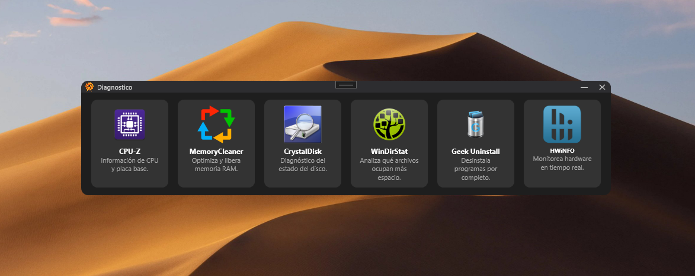

# Diagnostico

Aplicación de escritorio para diagnóstico y optimización rápida en Windows 10/11.

  <!-- Si no tienes logo, puedes eliminar esta línea -->

## 📝 Descripción

**Diagnóstico** es una herramienta ligera que permite acceder rápidamente a utilidades de diagnóstico y limpieza del sistema desde una interfaz sencilla.  

Esta aplicación integra y facilita el acceso a las siguientes herramientas de terceros:

- **CPU-Z** – para información detallada del hardware.  
- **Windows Memory Cleaner** – para limpiar y optimizar la memoria RAM.  
- **CrystalDisk** – para monitoreo y análisis de discos duros.  
- **WinDirStat** – para visualizar el uso de espacio en disco.  
- **Geek Uninstaller** – para desinstalación completa de programas.  
- **HWiNFO** – para supervisión avanzada del sistema y sensores.  

> Nota: Diagnóstico no incluye el código de estas herramientas; simplemente permite ejecutarlas desde su interfaz.

## 🚀 Descarga

El programa completo se puede descargar aquí:  
🔗 [Descargar Diagnostico Completo](https://www.mediafire.com/file/u2oejdxx0yjs7tx/Diagnostico_FULL.rar/file)

---

## 💻 Requisitos del Sistema

- **Sistema Operativo:** Windows 10/11
---

## ⚠️ Advertencias previas

- Descargue los ejecutables únicamente desde enlaces oficiales para evitar archivos maliciosos.
- Los programas incorporados son de licencia libre.

---

## 👤 Autor

- Usuario: `superbytecl`  

---

